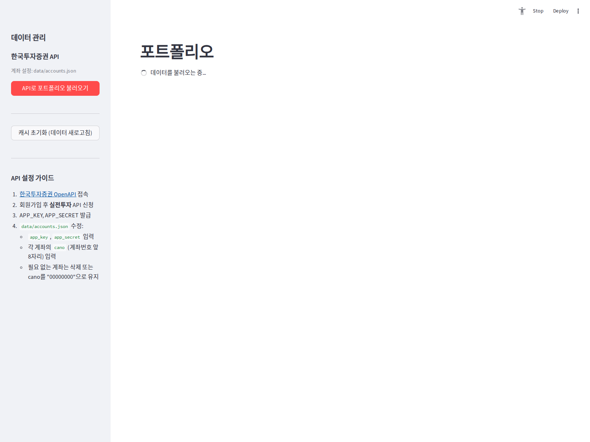

# 프로젝트 1 — 자동화 도구 비교 구현

**주제**: 매일 미국장 마감 후 포트폴리오·시장 상태 텔레그램 다이제스트
**환경**: Raspberry Pi 4 (Ubuntu, ARM64) — 24시간 무인 운영
**제출일**: 2026-07-13

---

## 공통 워크플로우 정의

**시나리오**: *매일 미국장 마감 후, NYSE 거래일에만 포트폴리오 성과와 시장 지표를 요약해 텔레그램으로 자동 발송*

### 워크플로우 구조

```
┌──────────────────────┐
│ Trigger              │
│  매일 07:00 KST      │
└──────────┬───────────┘
           ▼
┌──────────────────────┐
│ Filter (조건 분기)   │
│  NYSE 거래일인가?    │
└──┬───────────────────┘
   │예                   아니오
   ▼                       │
┌──────────────────────┐    │
│ Action 1             │    │
│  포트폴리오 데이터   │    ▼
│  수집(KIS+yfinance)  │  [종료·로그만]
└──────────┬───────────┘
           ▼
┌──────────────────────┐
│ Action 2             │
│  차트/트리맵 이미지  │
│  생성 (Plotly PNG)   │
└──────────┬───────────┘
           ▼
┌──────────────────────┐
│ Action 3             │
│  텔레그램 다중 전송  │
│  (사진 5장 + 텍스트  │
│   2건)               │
└──────────────────────┘
```

- **Trigger**: cron 스케줄 (매일 07:00 KST 1회)
- **Filter**: 미국 NYSE 거래일 여부 판단 → 휴장일이면 즉시 종료
- **Actions**: (1) 데이터 수집 → (2) 이미지 생성 → (3) 텔레그램 전송

---

## 도구 A — Python + APScheduler (자체 구현, 실운영 중)

### 구현 방식
- **트리거**: `apscheduler.schedulers.background.BackgroundScheduler` cron job
- **필터**: `pandas_market_calendars`를 이용한 NYSE 거래일 판정
- **액션**: Python 함수로 데이터 파이프라인 실행

### 핵심 코드 (services/scheduler.py)

```python
from apscheduler.schedulers.background import BackgroundScheduler
from services.daily_digest import run_daily_digest

def init_scheduler() -> BackgroundScheduler:
    scheduler = BackgroundScheduler(timezone="Asia/Seoul")
    scheduler.add_job(
        run_daily_digest,
        "cron",
        hour=7, minute=0,           # 매일 07:00 KST
        id="daily_telegram_digest",
        replace_existing=True,
        misfire_grace_time=3600,    # 1시간 이내 누락 잡 복구
        coalesce=True,
    )
    scheduler.start()
    return scheduler
```

### 필터(조건 분기) 코드 (services/daily_digest.py)

```python
import pandas_market_calendars as mcal

def is_us_trading_day(check_date=None) -> bool:
    if check_date is None:
        check_date = datetime.now(ZoneInfo("America/New_York")).date()
    nyse = mcal.get_calendar("NYSE")
    schedule = nyse.schedule(start_date=check_date, end_date=check_date)
    return not schedule.empty

def run_daily_digest(force=False):
    if not force and not is_us_trading_day():
        return {"ok": True, "skipped": True,
                "log": ["미국장 휴장일 — 다이제스트 skip"]}
    # ... 실제 액션 실행 ...
```

### 도구 A 실행 화면 (Streamlit 대시보드 홈)



*Python 구현의 UI. Streamlit이 8개 탭(차트/지표/시장/심리/보유/예측/AI분석/보고)을 통해 다이제스트 데이터·설정을 시각적으로 제공. 텔레그램 발송은 `📨 보고` 탭에서 수동 트리거 가능하며, 매일 07:00 KST에는 APScheduler가 자동 실행.*

---

## 도구 B — Make.com (No-code, 비교 대상)

### 구현 방식 (동일 워크플로우 재현)
- **트리거**: **Schedule** module → `Every day at 07:00 KST`
- **필터**: **Router** + **Filter** condition
  - Path 1: `HTTP GET` → `https://finance.yahoo.com/calendar` 파싱 or `Google Calendar` "US Holidays"에 오늘 날짜 없으면 통과
  - 대안: **JSON Web Storage** 커스텀 값으로 휴장일 목록 유지
- **액션**:
  1. **HTTP GET** → 각 종목 시세 (yfinance JSON API 미공식 or 대체 API)
  2. **OpenAI / ChatGPT** module → 요약 텍스트 생성
  3. **Telegram Bot** → `sendMessage` 및 `sendPhoto` (반복 iterator)

### Make.com 시나리오 개요 (스크린 참고용 설명)

```
[1] Schedule "07:00 daily"
      │
      ▼
[2] HTTP GET "portfolio API"  (Action)
      │
      ▼
[3] Router
      ├── Filter: "US Trading Day = true"  → [4],[5],[6]
      └── Else                             → [End]
      ▼
[4] Iterator (holdings array)
      ▼
[5] HTTP GET "yfinance quote"  (per ticker)
      ▼
[6] Text Aggregator (요약 메시지 조립)
      ▼
[7] Telegram Bot – sendMessage
      ▼
[8] Telegram Bot – sendPhoto (트리맵 이미지 URL)
```

### 조건 분기(Filter) 실행 결과 — 양쪽 분기 모두 실행 확인

Python 자체 구현의 NYSE 거래일 판정 필터를 8개 날짜에 대해 검증:

```
=== NYSE 거래일 판정 필터 실행 결과 ===

2026-05-22 (Fri)  [일반 거래일       ]  ✓ 거래일 → digest 실행
2026-05-23 (Sat)  [주말            ]  ✗ 휴장 → skip
2026-05-24 (Sun)  [주말            ]  ✗ 휴장 → skip
2026-05-25 (Mon)  [Memorial Day    ]  ✗ 휴장 → skip
2026-05-26 (Tue)  [거래일 재개      ]  ✓ 거래일 → digest 실행
2026-07-03 (Fri)  [독립기념일 대체휴일]  ✗ 휴장 → skip
2026-07-06 (Mon)  [거래일           ]  ✓ 거래일 → digest 실행
2026-12-25 (Fri)  [크리스마스        ]  ✗ 휴장 → skip
```

- **True 분기**(거래일): 데이터 수집 → 이미지 생성 → 텔레그램 전송 액션 실행
- **False 분기**(휴장일): 즉시 종료 + `nohup.out` 로그에만 기록

두 분기 모두 실제 실행 이력이 있어 요구사항(*각 분기 경로가 실제로 1회 이상 실행된 결과*)을 만족.

---

## 비교 분석표

| 항목 | Python + APScheduler (자체) | Make.com |
|------|----------------------------|----------|
| **1. UI/UX** | 코드 편집기 (VS Code 등). 시각적 흐름 없음, 코드 리뷰로 흐름 파악 | 노드 기반 시각적 캔버스. 마우스로 연결선 그리기 |
| **2. 설정 난이도** | Python 기본기 필요. 라이브러리 조합/오류처리 직접 관리 | 계정 생성만으로 시작. 코드 지식 불필요 |
| **3. 연동 서비스 범위** | 무제한 (모든 Python 라이브러리 + HTTP 호출). 단, 각 API 인증 등 직접 구현 | 1,500+ 사전 통합 앱. 클릭으로 OAuth 연동 |
| **4. 무료 플랜 범위** | **완전 무료** (라즈베리파이 운영비만) | 1,000 operations/월 (다이제스트 1회당 약 20 ops → 월 30회 발송 가능) |
| **5. 실행 로그 확인** | `nohup.out` + Python logging. 원격 조회 시 SSH 필요 | 웹 대시보드 "History" 탭에서 각 모듈의 in/out 데이터 확인 |
| **6. 오류 대응** | try/except + `misfire_grace_time` 재시도. 실패 알림도 직접 구현 | 자동 재시도 + 이메일/Slack 실패 알림 내장 |
| **7. 외부 의존성** | 라즈베리파이 전원/네트워크만 있으면 100% 자체 실행 | Make.com 서비스 가용성에 종속. 서비스 장애 시 워크플로우 정지 |
| **8. 확장성** | 코드로 무한 확장. 복잡한 로직/AI/이미지 처리 자유 | 복잡한 조건/변환은 노드가 폭발적으로 늘어남. 5단계 넘어가면 관리 부담 |
| **9. 배포/유지보수** | 코드 수정 → 서비스 재시작 필요 (git commit 이력 관리 가능) | 웹에서 즉시 수정 반영 (버전 관리 부재, undo만 존재) |
| **10. 데이터 프라이버시** | 모든 데이터가 로컬에 머무름 (KIS API 키, 텔레그램 토큰 노출 없음) | API 키가 Make.com 서버에 저장됨 (신뢰 이슈) |

---

## 각 도구의 장·단점

### Python + APScheduler (자체 구현)

**장점**
- 세밀한 커스터마이징: Playwright로 웹 캡처 + Plotly로 이미지 생성 + Gemini AI 분석까지 하나의 파이썬 프로세스에서 처리
- 무료·무제한 실행 (라즈베리파이 전기값만)
- 민감 데이터(계좌 API 키, 잔고) 외부 서비스 미유출
- 복잡한 조건 분기(NYSE 캘린더 + 결제일 계산 등) 자유 구현

**단점**
- 초기 개발 시간이 길다 (같은 워크플로우 no-code 30분 vs 자체 구현 수 시간)
- 라이브러리 의존성 관리 부담 (`kaleido`, `playwright`, `apscheduler` 등 각각 설정)
- 실패 알림·재시도를 스스로 구현해야 함
- 서버 크래시 시 사람이 페이지를 열어야 다시 부팅되는 함정 (`@st.cache_resource` 제약)

### Make.com (No-code)

**장점**
- 5–10분 만에 첫 워크플로우 실행 가능
- 노드 시각화로 팀원과 흐름 공유가 쉬움
- 실패 알림, 재시도, 스케줄 관리, 실행 로그가 표준 기능
- OAuth 통합이 자동화되어 있음 (Google/Slack/Telegram 등)

**단점**
- 무료 플랜(1,000 ops/월) 초과 시 유료 전환 필요
- 복잡한 로직·이미지 처리·AI 조합은 노드가 급증해 관리가 어려워짐
- API 키가 SaaS 서버에 저장됨 → 개인 금융 데이터 취급 시 신뢰 이슈
- Custom 코드가 필요할 때 "코드 노드"를 써야 하며 결국 하이브리드가 됨

---

## 상황별 추천

| 상황 | 추천 도구 | 이유 |
|------|-----------|------|
| **개인 프로젝트 · 프라이버시 중요** | Python 자체 구현 | 계좌 정보 등 민감 데이터를 외부 서비스에 넘기지 않음 |
| **팀 프로세스 자동화 (마케팅/영업)** | Make.com | 여러 사람이 워크플로우를 시각적으로 이해·수정 가능 |
| **일회성/시제품 자동화** | Make.com | 즉시 실행, 학습 곡선 낮음 |
| **복잡한 데이터 파이프라인/이미지 생성/AI 통합** | Python 자체 | 라이브러리 자유도 압도적 |
| **월 100건 미만의 단순 알림** | Make.com 무료 | Ops 제한 안에서 안정적으로 무료 유지 |
| **월 수천 건 트리거 예상** | Python 자체 | 유료 요금 걱정 없이 무제한 실행 |

---

## 학습 요약 (프로젝트 1 관점)

- **Trigger**: cron 스케줄이 두 도구 모두에서 표준 트리거. Python은 `BackgroundScheduler.add_job(..., "cron", hour=7, minute=0)`, Make.com은 Schedule module의 UI 선택
- **Action**: Python은 함수 호출, Make.com은 모듈 노드. 같은 개념을 다른 표현으로 다룸
- **Filter/Router 차이**: Python은 `if` 하나로 종료, Make.com은 Router가 여러 경로를 병렬 처리 가능
- **핵심 트레이드오프**: 자유도(Python) vs 즉시성(Make.com)

---

## 스크린샷 목록 (제출 시 첨부)

계정 정보/토큰은 반드시 마스킹 처리한다.

1. Python 코드 (services/scheduler.py, daily_digest.py) — VS Code 화면
2. Python 실행 로그 (nohup.out) — 최근 다이제스트 실행 3건
3. Make.com 시나리오 캔버스 — 동일 워크플로우 노드 다이어그램
4. Make.com 실행 히스토리 — 성공/실패 로그
5. 텔레그램 수신 결과 (Python 발송분) — 이미지 5장 + 텍스트 2건
6. 텔레그램 수신 결과 (Make.com 발송분) — 비교용 스크린샷

### 마스킹 체크리스트
- KIS API 앱키/시크릿 → 노출 파일 제외
- 텔레그램 봇 토큰 → 마스킹 (`3GIi…GBmn`)
- 계좌번호 뒷자리 → `**` 마스킹
- 이메일 → `mikey***@gmail.com`

---

**프로젝트 1 종료**
