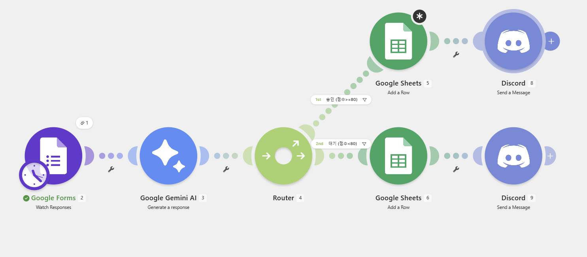
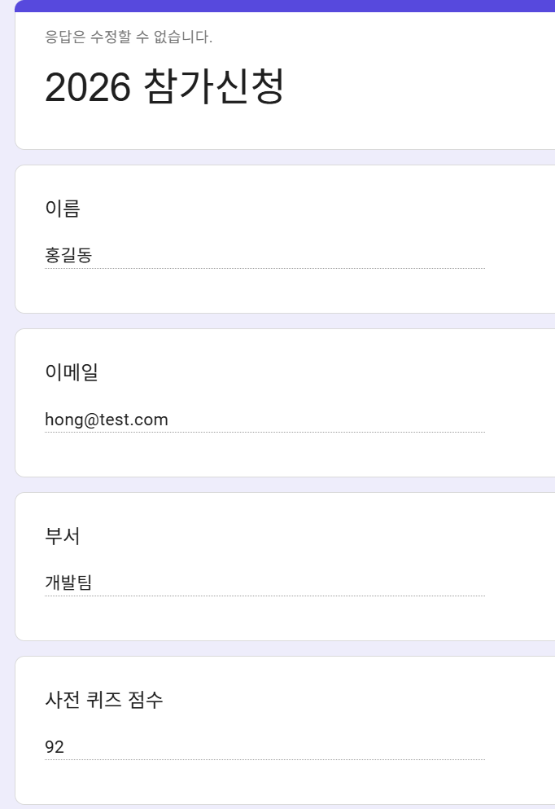
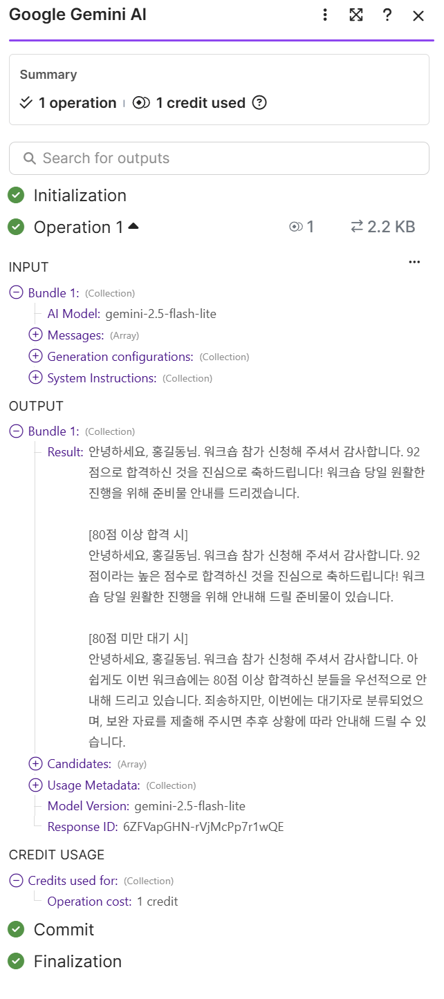
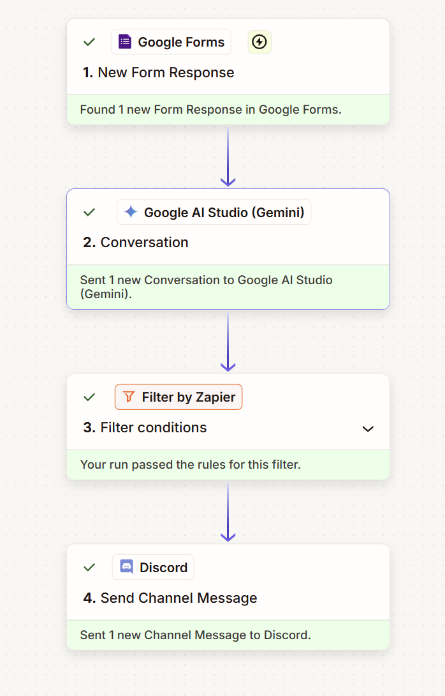
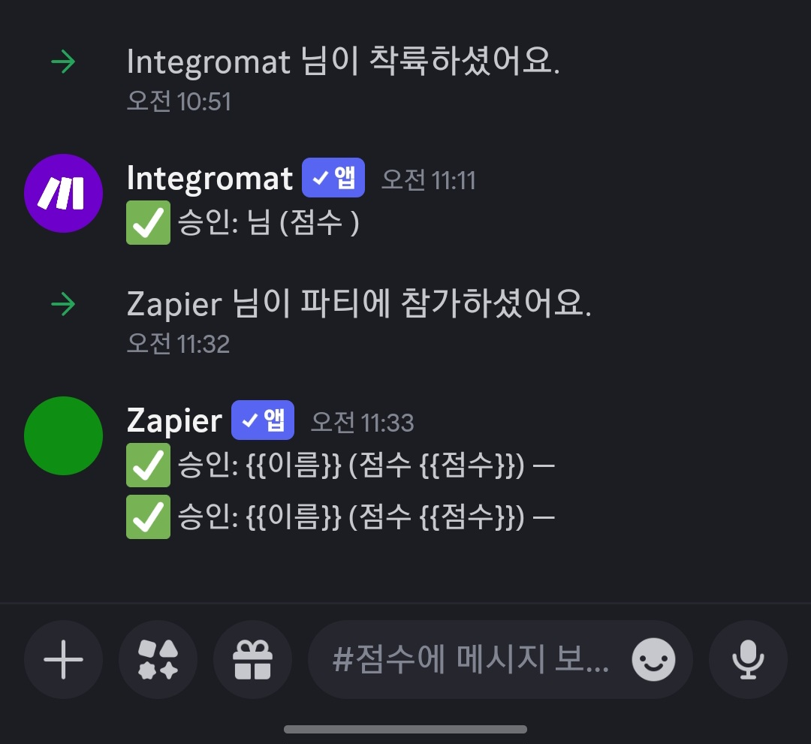

# [프로젝트 2] 자유 주제 자동화 설계 및 구현
## 주제: "워크숍 참가 신청 자동 심사·기록·안내"

> 작성일: 2026-07-14 · 사용 계정(마스킹): `de****@gmail.com`
> ※ 모든 스크린샷은 API Key·토큰·웹훅을 `***`로 마스킹 처리함.

---

## 1. 자동화할 반복 업무 정의
워크숍 참가 신청을 받을 때마다 담당자가 아래 작업을 **수작업으로 반복**한다.
1. 신청서의 사전 퀴즈 점수 확인
2. 기준(80점)에 따라 **승인 / 대기 분류**
3. 분류 결과를 시트에 **수기 기록**
4. 신청자에게 **개별 안내 메시지 작성·발송**

신청이 몰릴수록 시간이 오래 걸리고, 분류 실수·기록 누락·안내 지연이 자주 발생한다.

**자동화 목표**: 신청서가 제출되면 → 점수로 자동 분류 → 시트 자동 기록 → 맞춤 안내를 자동 발송하여 **사람 개입 0**으로 처리한다.

## 2. 선정 도구 및 선정 이유
**선정 도구: Make (Free 플랜)** — 조건 분기·에러 처리·AI 연동을 무료로 한 화면에서 구현할 수 있어 이 업무에 가장 적합.

| 선정 기준 | 이유 |
|-----------|------|
| 조건 분기 | **Router**를 무료로 지원 → 승인/대기 분기를 한 시나리오에서 구현 |
| AI 연동 | **Google Gemini** 모듈을 Action으로 직접 연결(맞춤 안내 생성) |
| 비용 | 무료 ops(1,000/월) 범위 내에서 충분히 운영 가능 |
| 로그/디버깅 | 모듈별 입출력 데이터를 상세히 확인 가능 |
| 시각적 흐름 | 트리거→AI→분기→기록/알림을 한 캔버스에서 직관적으로 관리 |

> 참고: 동일 워크플로우를 **Zapier로도 교차 구현**하여 도구별 특성을 비교하였으며(프로젝트 1 참조), 본 자유주제의 **주 구현 도구는 Make**로 선정하였다.

## 3. 구현 과정 요약

### 3-1. Make (주 구현 도구)
1. `Watch Responses`(Google Forms) 트리거 모듈 배치
2. **Google Gemini AI**(Generate a response) 모듈로 안내 메시지 생성
3. **Router** 추가 → 브랜치 2개에 각각 필터(≥80 / <80, Numeric 비교)
4. 각 브랜치에 `Add a Row`(Sheets, 승인자/대기자) + `Send a Message to a Channel`(Discord)
5. Gemini/Sheets 모듈에 **Error handler** 연결(오류로그 시트 적재)
6. `Run once`로 테스트 A·B 제출 → 두 경로 모두 실행 확인 → Scheduling ON

> **특징**: 한 시나리오(캔버스) 안에서 분기·에러처리까지 시각적으로 완성됨.
> **실제 이슈**: ① Google Forms 응답이 `answers[].value` 형태로 **깊게 중첩**돼 있어, 필터가 값을 못 읽고 두 갈래 모두 통과 실패(`⊘0`)하는 문제를 겪음 → `answers[1].value`까지 파고들어 해결. ② Gemini 503(과부하) 오류 발생 → 재시도로 해결(보너스2 소재).

**▼ Make 워크플로우 전체 구성 (Forms → Gemini → Router → Sheets → Discord)**

**▼ 트리거 입력 (Google Forms 제출 내용: 홍길동 / 92점 → 승인 경로)**

**▼ (보너스1) Gemini AI가 생성한 맞춤 안내 메시지 (Result 출력)**

### 3-2. Zapier (교차 검증)
1. **Zap A**(승인): Forms 트리거 → **Gemini(Google AI) 액션** → **Filter(≥80)** → Sheets(승인자) → Discord
2. **Zap B**(대기): Zap A 복제 후 **Filter(<80)** + 대기자 시트 + 대기 메시지로 변경
3. 두 Zap을 각각 Publish
4. 테스트 A → Zap A 실행 / 테스트 B → Zap B 실행 확인

> **특징**: 무료 플랜은 Paths(라우터) 미지원 → **Filter를 반대 조건으로 건 Zap 2개**로 분기를 나눠 구현.

**▼ Zapier 실행 로그 (Forms → Gemini → Filter 통과 → Discord, 전 단계 성공 ✅)**

### 3-3. 실행 결과 — Discord 알림 도착
Make·Zapier 양쪽 워크플로우에서 승인 알림이 동일한 Discord 채널로 실제 전송됨(알림 Action 정상 동작).

## 4. 워크플로우 흐름 설명 (단계별)
1. 신청자가 Google Form 제출 → **[Trigger] 워크플로우 자동 시작**
2. **[AI Action]** Gemini가 신청 내용으로 맞춤 안내 메시지 생성 (사람 개입 없음)
3. **[조건 분기]** Router가 사전 퀴즈 점수를 80점 기준으로 판정
   - 점수 ≥ 80 → **승인 경로**
   - 점수 < 80 → **대기 경로**
4. **[Action 1]** 해당 경로의 Google Sheets(승인자/대기자)에 자동 기록
5. **[Action 2]** Discord 채널로 승인/보완 안내 자동 발송
6. **(보너스2)** 저장·생성 실패 시 Error handler가 관리자에게 알림 + `오류로그` 시트에 원문 적재

## 5. 자동 실행(트리거) 증빙
- 폼에 **테스트 A(홍길동, 92점)** 제출 → 승인 경로 자동 실행 → 승인자 시트 기록 + 승인 알림
- 폼에 **테스트 B(김철수, 65점)** 제출 → 대기 경로 자동 실행 → 대기자 시트 기록 + 보완 알림
- 두 케이스로 **조건 분기 양쪽 경로가 각각 1회 이상 실제 실행**됨을 실행 로그에서 확인

## 6. 기대 효과
- 신청 건당 수작업(점수 확인→분류→기록→안내) **수 분 → 0분(완전 자동)**
- 분류 실수·기록 누락 제거, 안내 즉시 발송, 신청 이력 자동 축적
- AI 맞춤 문구로 안내 품질 일관성 확보

## 7. 학습 정리 (과제 목표 대응)
- **Trigger/Action**: 폼 제출(Trigger) 이후 AI 생성·시트 기록·알림 발송(Action)이 자동 연쇄됨을 구현으로 확인.
- **조건 분기(Router/Filter)**: 점수 기준으로 경로를 나누어 승인/대기를 자동 분류.
- **도구 선택 근거**: 분기·에러 처리·AI를 무료로 통합하기 위해 Make를 선정.
- **자동화 흐름**: 트리거 → AI → 분기 → 기록/알림 → (실패 시)대체 경로의 단계별 흐름을 설계·검증.
