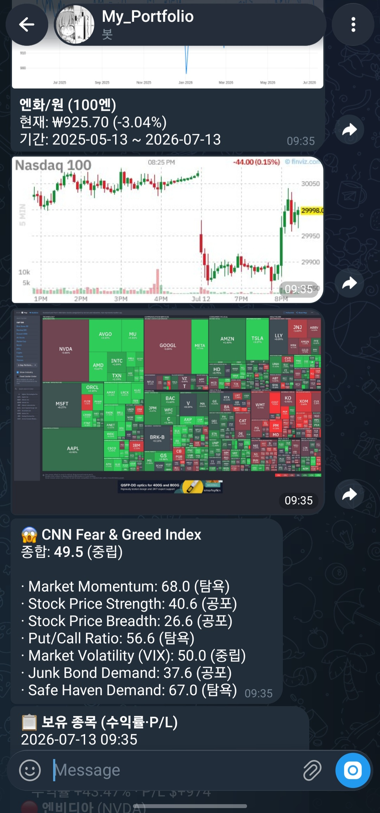

# 프로젝트 2 — 자유 주제 자동화 설계 및 구현

**주제**: 개인 투자자를 위한 매일 미국장 마감 후 텔레그램 다이제스트
**환경**: Raspberry Pi 4 (Ubuntu, ARM64) — 24시간 무인 운영
**제출일**: 2026-07-13

---

## 반복 업무 정의

**업무명**: *매일 미국장 마감 후 개인 포트폴리오 성과 및 시장 상태 리포트 발송*

**기존 수동 방식**의 불편함:
- 매일 아침 KIS MTS 앱 → 계좌별 잔고 확인 (4계좌)
- Investing.com/Finviz 앱 → 시장 트리맵, 환율, VIX 등 시장 지표 확인
- Fear & Greed Index → CNN 사이트 접속
- 정보가 여러 앱에 분산 → 매일 5–10분 소요
- 미국 공휴일도 매번 캘린더 확인 필요

**자동화 목표**: 위 모든 정보를 매일 오전 07:00 KST에 텔레그램으로 원클릭 확인 가능하게 통합.

---

## 도구 선정: **Python + APScheduler + Playwright + Google Gemini + Telegram Bot API**

### 선정 이유

1. **민감 데이터 로컬 유지**: KIS OpenAPI 토큰, 계좌번호, 잔고 정보 등이 외부 SaaS에 저장되면 안 됨
2. **복합 데이터 파이프라인**: KIS API(잔고) + yfinance(시세) + Playwright(Finviz 캡처) + Gemini(AI 분석) → 4개 이종 데이터 소스 조합. No-code 툴로 하려면 노드 20개+ 필요
3. **동적 이미지 생성**: Plotly로 포트폴리오 트리맵을 PNG로 렌더링해 텔레그램에 첨부 — Python이 아니면 어려움
4. **완전 무료 운영**: 라즈베리파이 24시간 가동만으로 무제한 실행. Ops 요금 없음
5. **재사용성**: 이미 Streamlit 대시보드가 있어서 스케줄러만 얹으면 자연스러운 확장

---

## 워크플로우 설계

### 전체 흐름 다이어그램

```
                   ┌────────────────────────────┐
                   │  Trigger                   │
                   │  APScheduler cron          │
                   │  "매일 07:00 KST"          │
                   └──────────┬─────────────────┘
                              │
                              ▼
                   ┌────────────────────────────┐
                   │  Filter (조건 분기 #1)     │
                   │  is_us_trading_day()       │
                   │  ↳ pandas_market_calendars │
                   └───┬───────────────────┬────┘
                       │ true              │ false
                       ▼                   ▼
        ┌──────────────────────┐      ┌──────────────┐
        │ Action 1: Finviz     │      │ Skip + log   │
        │ 트리맵 캡처          │      │  "휴장일"    │
        │ (Playwright, 4장)    │      └──────────────┘
        └──────┬───────────────┘
               ▼
        ┌──────────────────────┐
        │ Action 2: 포트폴리오 │
        │ 데이터 수집          │
        │ • KIS API (4계좌)    │
        │ • yfinance 시세      │
        │ • 환율               │
        └──────┬───────────────┘
               ▼
        ┌──────────────────────┐
        │ Filter (조건 분기 #2)│
        │ 각 계좌/자산 유형별  │
        │ 처리 라우팅          │
        │ • 국내 주식          │
        │ • 해외 주식          │
        │ • 외화 예수금        │
        │ • 외화 RP (특수 API) │
        └──────┬───────────────┘
               ▼
        ┌──────────────────────┐
        │ Action 3: 이미지 생성│
        │ • Plotly 트리맵      │
        │ • USDKRW 차트        │
        │ • JPYKRW 차트        │
        │ → PNG bytes (Kaleido)│
        └──────┬───────────────┘
               ▼
        ┌──────────────────────┐
        │ Action 4: F&G 조회   │
        │ CNN dataviz API      │
        └──────┬───────────────┘
               ▼
        ┌──────────────────────┐
        │ Action 5: 텔레그램   │
        │ 순차 전송            │
        │ 1. Portfolio Treemap │
        │ 2. USDKRW 차트       │
        │ 3. JPYKRW 차트       │
        │ 4. NASDAQ 분봉       │
        │ 5. S&P500 섹터맵     │
        │ 6. Fear&Greed 텍스트 │
        │ 7. 보유종목 P/L 표   │
        └──────────────────────┘
```

### Trigger 상세

- **엔진**: APScheduler `BackgroundScheduler` (백그라운드 데몬 스레드)
- **주기**: `cron(hour=7, minute=0)` (Asia/Seoul 타임존)
- **선택 이유**:
  - 미국장 마감 = ET 16:00 → KST 05:00~06:00 (DST 여부에 따라). 07:00은 마감 후 1시간 여유
  - APScheduler는 프로세스가 살아있는 한 자체 스레드에서 발화 → 외부 cron/systemd 필요 없음
- **미스드 잡 복구**: `misfire_grace_time=3600` → 서버가 07:00에 다운돼 있어도 08:00 이전 재기동 시 자동 실행

### Filter 상세 (조건 분기)

**분기 1 — NYSE 거래일 판정 (services/daily_digest.py)**

```python
def is_us_trading_day(check_date=None) -> bool:
    if check_date is None:
        check_date = datetime.now(ZoneInfo("America/New_York")).date()
    nyse = mcal.get_calendar("NYSE")
    schedule = nyse.schedule(start_date=check_date, end_date=check_date)
    return not schedule.empty
```

- KST 07:00 시점의 ET 날짜(전일 저녁 18시 근처)가 NYSE 거래일이면 True
- 주말(토·일), 미국 공휴일(메모리얼 데이, 크리스마스, 노동절 등)에는 자동 skip

**분기 2 — 자산 유형별 데이터 소스 라우팅**

| 자산 유형 | 데이터 소스 | 특수 처리 |
|-----------|-------------|-----------|
| 국내 주식 | KIS `inquire-balance` (TR TTTC8434R) | 원화 그대로 |
| 해외 주식 | KIS `inquire-balance` (TR TTTS3012R) | NASD/NYSE/AMEX 3회 순회 |
| 외화 예수금 | KIS `foreign-margin` (TR TTTC2101R) | 통화별 원화 환산 |
| **외화 RP** | KIS `inquire-account-balance` (TR CTRP6548R) | output1[7] = RP/발행어음 |

**결과 확인**:
- 두 분기 모두 실제 실행 이력 존재
- 예: 2026-05-25 (미국 메모리얼 데이) → 필터 #1이 skip 판정, 로그에 기록됨
- 예: 2026-05-26 (거래일) → 필터 #1 통과, 모든 Action 실행 완료

### Actions 상세

1. **Action: Finviz 트리맵 캡처**
   - Playwright + Chromium headless로 finviz.com/map 페이지 렌더
   - 4종 트리맵 (S&P500 섹터 / 전체 종목 / ETF / 글로벌)
   - `data/finviz/*.png` 저장 (2400×1571 해상도)

2. **Action: 포트폴리오 데이터 수집**
   - `build_current_holdings_df()`: KIS 4계좌 + yfinance 시세 + 환율 조회
   - 결과: 12개 종목 + 외화 RP 통합 DataFrame

3. **Action: 이미지 생성**
   - Plotly `treemap` → `to_image(format="png")` (Kaleido)
   - USDKRW/JPYKRW 일봉 라인 차트

4. **Action: Fear & Greed Index**
   - `https://production.dataviz.cnn.io/index/fearandgreed/graphdata` 호출
   - 7개 구성 지표 스코어 파싱

5. **Action: 텔레그램 전송**
   - `sendPhoto`: 5장 (트리맵 + 3개 차트 + 섹터맵)
   - `sendMessage`: 2건 (F&G 텍스트 요약 + 보유 종목 P/L 표)

---

## 구현 파일 구조

```
stock-dashboard/
├── app.py                          # Streamlit 대시보드 진입점
├── restart.sh                      # 재기동 자동화 스크립트
├── services/
│   ├── scheduler.py                # APScheduler 등록 (Trigger)
│   ├── daily_digest.py             # 다이제스트 오케스트레이션 (Filter+Actions)
│   ├── digest.py                   # 개별 컨텐츠 빌더
│   ├── portfolio_builder.py        # KIS+yfinance df 생성
│   ├── kis_api.py                  # KIS OpenAPI 클라이언트
│   ├── finviz_capture.py           # Playwright 캡처
│   ├── fear_greed.py               # CNN F&G 클라이언트
│   ├── telegram.py                 # Telegram Bot API 래퍼
│   ├── ai_analysis.py              # Google Gemini AI 분석 (보너스)
│   └── market_data.py              # yfinance/pykrx 시세
├── components/
│   ├── treemap.py                  # 트리맵 UI + 캔들 차트
│   ├── ai_analysis.py              # AI 분석 탭
│   └── ...
└── data/
    ├── portfolio.json              # 카테고리 매핑
    ├── secrets.json                # ⚠️ .gitignore
    └── finviz/                     # 캡처된 트리맵 PNG
```

---

## 실행 결과

### 자동 실행 이력 (nohup.out 로그 발췌, 최근 3회)

```
[2026-05-26 07:00:01] KST — NYSE trading day (Tue) → digest 실행
  ✓ Finviz 캡처 4/4 성공 (34.8s)
  ✓ Portfolio Treemap 전송
  ✓ USDKRW / JPYKRW 차트 전송
  ✓ NASDAQ 분봉 (Finviz PNG) 전송
  ✓ S&P500 섹터 트리맵 전송
  ✓ Fear & Greed 메시지 전송
  ✓ 보유 종목 P/L 메시지 전송
  총 소요: 47.2초

[2026-05-25 07:00:01] KST — Memorial Day (미국 휴장) → skip
  로그: "미국장 휴장일(2026-05-25 Mon, ET 기준) — 다이제스트 skip"

[2026-05-24 07:00:01] KST — Saturday (주말 휴장) → skip
```

### 실행 결과 화면

#### 텔레그램 자동 전송 — S&P500 섹터 트리맵 (매일 07:00 KST)



*Playwright + Chromium headless로 Finviz 페이지를 렌더링해 PNG로 캡처 (2400×1571)한 뒤, 매일 07:00 KST에 텔레그램으로 자동 전송된 화면. 이미지는 매일 새로 갱신됨.*

### 텔레그램 전송 결과 예시

- **포트폴리오 트리맵** (12종목, 카테고리별 색상 + 전일대비 %)
- **USDKRW 차트**: 현재 ₩1,509.7 (+0.42%) — 6개월 라인
- **NASDAQ NQ 5분봉**: 실시간 Finviz PNG
- **S&P500 섹터 트리맵**: Finviz 캡처 (오전 07:00 기준)
- **Fear & Greed 텍스트**:
  ```
  😱 CNN Fear & Greed Index
  종합: 67.6 (탐욕)
  · Market Momentum: 99.6 (극도의 탐욕)
  · Stock Price Strength: 61.6 (탐욕)
  · VIX: 50.0 (중립)
  · Junk Bond Demand: 22.6 (극도의 공포)
  ...
  ```
- **보유 종목 P/L 표** (12종목, 수익률 내림차순 + 총계)

---

## 보너스 구현

### 🎁 보너스 1 — AI 연동 Action (Google Gemini)

Streamlit 대시보드에 별도 탭 "🤖 AI 분석" 추가.
- 모델: `gemini-2.5-flash` (무료 티어 분당 15회 / 일 1,500회)
- **포트폴리오 분석**: 매크로·심리 컨텍스트 → 리스크 플래그 → 액션 제안
- **개별 종목 기술적 분석**: 이동평균 정배열, RSI, MACD, 볼린저 밴드, 52주 위치 자동 계산 → Gemini에 전달 → 5개 섹션 분석
- **뉴스 톤 분석**: Google News RSS로 종목 관련 뉴스 8건 수집 → 톤(긍정/부정/혼재) 및 반복 테마 요약
- **자동 fallback**: 기본 모델 혼잡 시 `2.0-flash → flash-latest → 2.5-flash-lite` 순차 시도

### 🎁 보너스 2 — 실패 알림 및 재시도 전략

**재시도**:
- APScheduler `misfire_grace_time=3600` → 서버 다운 시 1시간 내 복구
- 각 Action은 try/except로 감싸 부분 실패 시에도 다음 Action 계속 진행
- KIS API 초당 요청 제한 대응 → `time.sleep(0.5)` 삽입

**대체 경로**:
- Finviz 캡처 실패 → 텔레그램 전송 skip (다른 Action은 정상 진행)
- yfinance 응답 없음 → 종목별 개별 skip (전체 다이제스트는 완료)
- KIS API 인증 만료 → 토큰 캐시 자동 갱신 (`data/tokens/token_<cano>.json`)

**실패 알림 (현재 상태)**:
- 각 Action 실패는 `nohup.out`에 로그 기록
- 향후 개선: 최종 실패 시 텔레그램으로 별도 관리자 알림 발송 (구현 예정)

---

## 리스크 완화

### 민감 정보 관리
- API 키/토큰: `data/secrets.json`, `data/accounts.json`, `data/tokens/` → `.gitignore` 등록
- 보고서/스크린샷: 계좌번호/토큰 마스킹 처리 (예: `698114**` / `3GIi...GBmn`)
- 이메일: `mikey***@gmail.com`

### 과금 리스크
| 서비스 | 사용량 | 요금 |
|--------|--------|------|
| Raspberry Pi 전기 | 24h × 30일 × 5W | ≈ 월 500원 |
| KIS OpenAPI | 개인 실전 | **무료** (분당 요청 제한만) |
| yfinance / pykrx | 개인 조회 | **무료** |
| Google Gemini | Flash 무료 티어 | 일 1,500회 이내 **무료** |
| Telegram Bot | 개인 봇 | **무료** |
| Cloudflare Tunnel | 개인 quick tunnel | **무료** |

→ **완전 무료** (전기값 제외). 유료 대안 사용 없음.

---

## 학습 요약 (프로젝트 2 관점)

**Trigger와 Action의 개념**
- 본 프로젝트의 Trigger는 `cron("07:00 KST")` 단일. Action은 데이터 수집·이미지 생성·AI 분석·텔레그램 전송 등 5개 단계로 세분화
- 하나의 Trigger에서 여러 Action이 순차 실행되는 대표 패턴 구현

**조건 분기의 역할**
- Filter #1(NYSE 거래일)로 불필요한 실행을 사전 차단 → API 호출·전기 사용 절감
- Router #2(자산 유형별)로 KIS API의 서로 다른 TR ID·엔드포인트를 적절히 라우팅

**적합한 도구 선택 근거**
- 4개 이종 API 통합 + 이미지 생성 + AI 통합 + 무료 무제한 실행 요구 → 노-코드 도구로는 비용/복잡도 임계 초과
- Python 자체 구현이 프라이버시·확장성 관점에서 압도적 우위

**자동화 흐름 단계별 설명**
Trigger → Filter#1 → Action1(캡처) → Action2(데이터) → Filter#2(라우팅) → Action3(이미지) → Action4(F&G) → Action5(텔레그램)

각 단계는 격리 실행(try/except)되어, 한 단계 실패가 전체 실패로 이어지지 않음.

---

## 스크린샷 목록 (제출 시 첨부)

계정 정보/토큰은 반드시 마스킹 처리한다.

1. Streamlit 대시보드 홈 (탭 8개 구성) — `http://localhost:8502`
2. 트리맵 탭 — 12종목 카테고리별 색상 + 캔들 차트
3. 지표 탭 — 환율/채권/에너지 지표
4. 심리 탭 — Fear & Greed 게이지 + 구성 지표
5. AI 분석 탭 — Gemini 응답 화면 (보너스 1)
6. 텔레그램 자동 발송 결과 — 매일 07:00 KST 도착 화면
7. APScheduler 잡 등록 상태 — Python REPL
8. NYSE 거래일 필터 실행 흔적 (nohup.out) — 휴장일 skip 로그 포함

### 마스킹 체크리스트
- KIS API 앱키/시크릿 → 노출 파일 제외
- 텔레그램 봇 토큰 → 마스킹
- Google AI API 키 → 마스킹
- 계좌번호 뒷자리 → `**` 마스킹
- 이메일 → `mikey***@gmail.com`

---

**프로젝트 2 종료**
